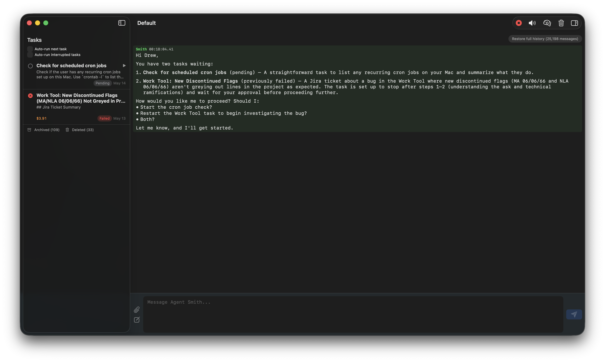

<div align="center">


# Agent Smith

**A multi-agent workforce for your Mac.** You hand it a task; a team of LLM agents plans it, does the work in a real shell, and reviews itself — with a dedicated security agent watching every move.

A native macOS app. Swift 6, SwiftUI, on-device. Your API keys, your machine.



</div>

## The cast

Four fixed roles, each with one job:

| Agent | Role |
| --- | --- |
| **Smith** | Orchestrator. Talks to you, breaks requests into tasks, supervises the work, reviews results. Never touches the tools itself. |
| **Brown** | Worker. Spawned per task with the bash, file, and process tools to actually get things done. |
| **Security Agent** | Security gatekeeper. Silently rates every one of Brown's tool calls — `SAFE` / `WARN` / `UNSAFE` / `ABORT` — and can stop the line. |
| **Summarizer** | Distills finished tasks into memory the team can draw on later. |

## Highlights

- **Real tools, real shell** — Brown runs `bash`, reads and edits files, manages processes. Not a sandbox toy.
- **Security built in, not bolted on** — Security Agent gates destructive actions before they run. Separation of duties by design.
- **Multi-session** — run independent jobs side by side in their own tabs and windows.
- **Persistent memory** — semantic-search-backed memory so the team remembers what it learned.
- **Agent inspector** — open any agent's full conversation, tool calls, and security verdicts, live or after the fact.
- **Bring your own model** — Anthropic, Gemini, Ollama, LM Studio, OpenRouter, Mistral, and any OpenAI-compatible endpoint, via [SwiftLLMKit](../swift-llm-kit). Keys live in the Keychain, never in config.
- **Usage & cost tracking** — every call is metered and grouped by run.
- **MCP support** — extend the team with Model Context Protocol servers.

## Requirements

- macOS 26.2 or later
- Xcode 16+
- An API key for at least one supported provider (or a local model via Ollama / LM Studio)

## Build & run

Open in Xcode and run the `AgentSmith` scheme:

```
open AgentSmith/AgentSmith.xcodeproj
```

The engine lives in the local Swift package `AgentSmithKit` (`AgentSmithPackage/`). It depends on two sibling repos checked out alongside this one:

```
../swift-llm-kit        # providers, model configs, Keychain key storage
../swift-semantic-search # on-device semantic memory
```

Run the package tests from the terminal:

```
cd AgentSmithPackage && swift test --skip MemoryStoreIntegrationTests
```

## License

Copyright © Nuclear Cyborg Corp. All rights reserved.
