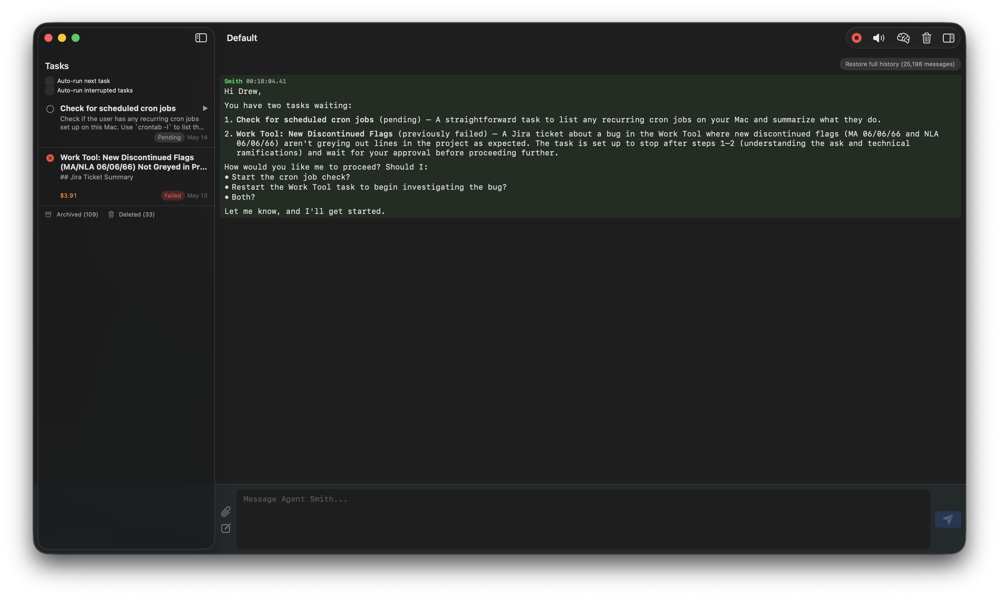

<div align="center">


# Agent Smith

**A safety-focused multi-agent workforce for your Mac.** You hand it a task; a team of LLM agents plans it, does the work in a real shell, and reviews itself — with a dedicated security agent watching every move.

A native macOS app. Swift 6, SwiftUI, on-device. Your API keys, your machine.



</div>

> [!NOTE]
> ### 👋 A special note for *Drew and Dan in the Morning* fans
>
> Thanks for checking this out — really. You're among the first people running Agent Smith outside my own machine, and that's exactly the stage where outside eyes are worth the most.
>
> **Please open a GitHub issue with any and all feedback:** [file an issue here](https://github.com/drewster99/macos-agent-smith/issues/new). Bugs, crashes, confusing UI, an agent that did something strange, a feature you went looking for and couldn't find, or just "this part felt wrong" — all of it is welcome, and all of it is greatly appreciated. Nothing is too small or too rough to report.

## Why it's different

Most AI coding tools are a single agent in a chat loop that you watch. Agent Smith is a small, self-supervising team: an **orchestrator** turns your request into tracked tasks and delegates them, **workers** carry them out in a real shell — several at once — a **security agent** rates every action *before* it runs, and each task's **acceptance criteria** get independently judged before anything is called done. It runs locally, works with any model you point it at, and keeps working through a task list — not just a single prompt.

## The cast

Four agents, each with one job — plus a judge that deliberately isn't one of them:

| Agent | Role |
| --- | --- |
| **Smith** | Orchestrator. Talks to you, turns requests into tasks with acceptance criteria, spawns and supervises workers. Never does the work — and never grades it either. |
| **Brown** | Worker. Spawned per task with the bash, file, and process tools to actually get things done. Several run at once, one per task. |
| **Security Agent** | Security gatekeeper. Silently rates *every* agent's tool calls — `SAFE` / `WARN` / `UNSAFE` / `ABORT` — and can stop the line. |
| **Summarizer** | Distills finished tasks into memory the team can draw on later. |
| **Validator** | Not a standing agent: each acceptance criterion is judged on its own, by a model you assign. The agent that ordered the work never signs off on it. |

## Models and providers

**Thirteen providers ship preconfigured**, and every role gets its own model — so you can run the worker on a local model and have a frontier model judge its work, or any mix you like. API keys live in the macOS Keychain, never in config files.

| | |
| --- | --- |
| **Shown by default** | Anthropic · OpenAI · Gemini · Grok · OpenRouter |
| **Also built in** | Mistral · Hugging Face · Alibaba Cloud · Meta Model API · z.ai |
| **Run locally** | Ollama · LM Studio — no API key, nothing leaves the machine (an Ollama Cloud preset is included too) |
| **Anything else** | Any OpenAI-compatible endpoint, by URL |

Endpoints, model catalogs, and pricing metadata come from [SwiftLLMKit](https://github.com/drewster99/swift-llm-kit).

## Highlights

- **Real tools, real shell** — Brown runs `bash`, reads and edits files, manages processes, fetches the web. Not a sandbox toy.
- **Security built in, not bolted on** — every tool call from every agent routes through the Security Agent before it runs. There is no unreviewed path, and no setting to create one.
- **Work is checked, not rubber-stamped** — each acceptance criterion is judged on its own, by a model assigned separately from the one doing the work.
- **Multi-session** — run independent jobs side by side in their own tabs and windows.
- **Persistent memory** — semantic-search-backed memory so the team remembers what it learned across runs.
- **Agent inspector** — open any agent's full conversation, tool calls, and security verdicts, live or after the fact.
- **Bring your own model** — thirteen providers built in, any OpenAI-compatible endpoint, and a different model per role. See [Models and providers](#models-and-providers).
- **Usage & cost tracking** — every call is metered and grouped by run.
- **MCP support** — extend the team with Model Context Protocol servers.

## Requirements

- **To run:** an Apple Silicon Mac on macOS 26.2 or later, and an API key for at least one supported provider (or a local model via Ollama / LM Studio). Intel Macs aren't supported — the on-device embedding model that backs semantic memory runs on MLX, which is Apple Silicon only.
- **To build from source:** the above, plus Xcode 26.2 or later — the app targets macOS 26.2, so earlier Xcode versions won't have the SDK for it.

## Install

Download the latest `.dmg` from [Releases](https://github.com/drewster99/macos-agent-smith/releases), open it, and drag **Agent Smith** to Applications. Builds are Developer ID signed and notarized by Apple, so they open with a normal double-click — no Gatekeeper detour.

### Or build from source

Clone and open in Xcode — Swift Package Manager resolves the dependencies automatically, no side-by-side checkouts needed:

```
git clone https://github.com/drewster99/macos-agent-smith.git
open macos-agent-smith/AgentSmith/AgentSmith.xcodeproj
```

Run the `AgentSmith` scheme. The engine lives in the local Swift package `AgentSmithKit` (`AgentSmithPackage/`), which pulls [swift-llm-kit](https://github.com/drewster99/swift-llm-kit) and [swift-semantic-search](https://github.com/drewster99/swift-semantic-search) as versioned dependencies. Run the package tests from the terminal:

```
cd AgentSmithPackage && swift test --skip MemoryStoreIntegrationTests
```

## First run

A setup flow walks you through it: pick a provider (Anthropic, OpenAI, Gemini, or local Ollama), paste an API key if it needs one, and it pre-fills a tested model for each of the five roles — which you can change on the same screen. You can also skip it and wire things up yourself in Settings and the **Agents** inspector.

The roles are independent on purpose: nothing falls back to another role's model, so a role left unset simply doesn't run. In particular, tasks queue up unjudged until the Validator has a model.

## A note on safety

Agent Smith runs LLM-generated commands — including a real shell — on your machine. The Security Agent vets actions before they run, but it's a mitigation, not a sandbox, and LLMs make mistakes. This is early software: keep backups, point it at work you can afford to have go sideways, and use it at your own risk.

## License

Licensed under the [Apache License 2.0](LICENSE). Copyright © 2026 Nuclear Cyborg Corp.
